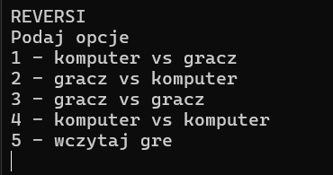
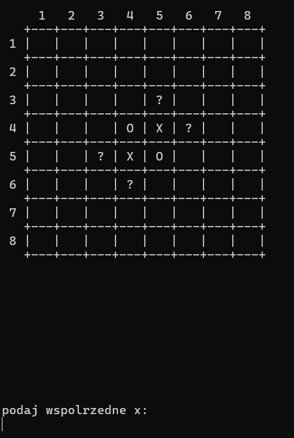
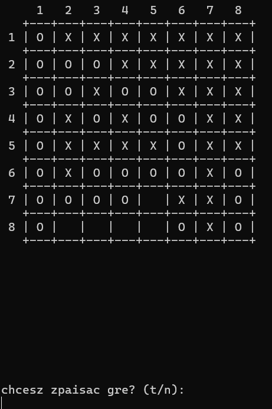
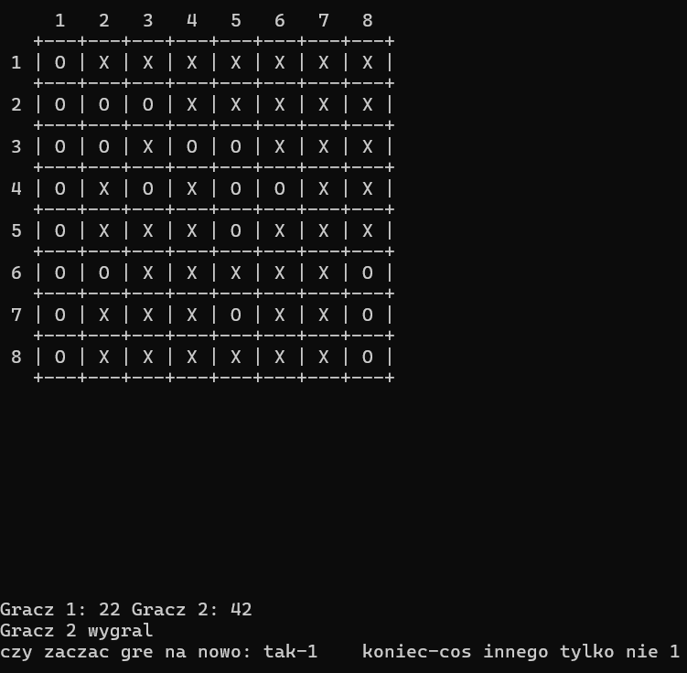

# Reversi - Gra w C++

## Opis projektu
Reversi to strategiczna gra planszowa dla dwóch graczy. Celem gry jest zajęcie jak największej liczby pól na planszy swoimi pionkami, odwracając pionki przeciwnika. Ten projekt to implementacja gry Reversi w języku C++, z możliwością gry przeciwko komputerowi lub drugiemu graczowi. Projekt został wykonany jako zadanie zaliczeniowe (projekt) na przedmiot **Programowanie Obiektowe**.

## Funkcjonalności
- Gra dla dwóch graczy.
- Gra przeciwko komputerowi.
- Zapisywanie i wczytywanie stanu gry.
- Dynamiczna plansza (możliwość zmiany rozmiaru).
- Oznaczanie możliwych ruchów.
- Dodane testy jednostkowe w celu sprawdzenia poprawności funkcjonalności gry

## Przykładowe zrzuty ekranu
1. **Menu główne**:
   
2. **Plansza gry**:
   
3. **Plansza gry**:
   
4. **Koniec gry**:
   

## Możliwe zmiany w kodzie w przyszłości

- Dodanie interfejsu graczicznego.
- Inteligentny wybór ruchu przez gracza komputer, aby był trudniejszym przeciwnikiem.
